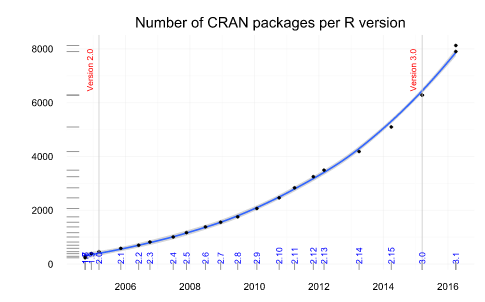

Introduction to R and RStudio
========================================================
author: Sofia M. Danna
date: 7 October 2016

Musings on the nature of R
========================================================
Open source

- free to download, use, distribute, and **expand on**

"In essense, Stata is pretty much statistical software that has a command line. R is a statistical programming language."
([reddit](https://www.reddit.com/r/statistics/comments/55neu0/stata_or_r/))

- flexibility: can easily write functions and packages

When you get stuck, remember the answer you are looking for is sitting somewhere in the internet. 

- Google and [Stack Overflow](http://stackoverflow.com/) are your friends.

Visual musings
========================================================

 [r-bloggers.com](https://www.r-bloggers.com/on-the-growth-of-cran-packages/)

[R now has 150 **times** more commands than SAS](http://www.statsblogs.com/2015/05/22/r-now-contains-150-times-as-many-commands-as-sas/)

Overview
========================================================
- [Github](https://github.com/smdanna)
- Install R and RStudio 
- Exploring RStudio + create project, file
- R as calculator
- Basic commands
- Downloading packages  []
- Analysis example  []
- Graphics  []
- Resources for learning on your own

R as calculator
========================================================

```r
2+4
```

```
[1] 6
```
assign value to an object

```r
apple <- 2+4
bee <- 7**3
```
print the value of this object

```r
apple
```

```
[1] 6
```

```r
bee
```

```
[1] 343
```
how to write `<-`: Option + - on Mac, Alt + - on Windows or Linux ([keyboard shortcuts](https://support.rstudio.com/hc/en-us/articles/200711853-Keyboard-Shortcuts)) 
R as calculator
========================================================


```r
3*apple+cos(89^2)/bee
```

```
[1] 17.99854
```
change apple and recalculate

```r
apple <- 42
3*apple+cos(89^2)/bee
```

```
[1] 125.9985
```

Basic commands - documentation, execution, tab completion
========================================================
No need to memorize, just know it exists so you can find it later

* `help()` and `?command`

* To execute code:
  + Control + Enter to execute line-by-line
  + highlight what you want to run, then Control + Enter
  + click Run button

* tab completion

* `"", (), [], {}`
 
Basic commands - comments and headings
========================================================
`# comment and label code with a hashtag, not unlike Twitter`

create a collapsible heading in several ways

`# Title 1 ####`

`## Title 2 ####`

`# Title 3 ----`

`## Title 4 ----`

Basic commands - vectors
========================================================
* create vectors

```r
cars <- c(3,1,91,1,0)
cars
```

```
[1]  3  1 91  1  0
```

```r
names  <- c("merkel","the pope","kardashian","norbert","sofia")
spicy  <- c(.1, .01, .5, .3, .85) 
dog  <- c(NA, 0, NA, NA, 0)
```
Basic commands - dataframe
========================================================
* create dataframe

```r
ppl <- data.frame(names, cars, spicy, dog)
ppl
```

```
       names cars spicy dog
1     merkel    3  0.10  NA
2   the pope    1  0.01   0
3 kardashian   91  0.50  NA
4    norbert    1  0.30  NA
5      sofia    0  0.85   0
```

```r
View(ppl)
```
Basic commands - indexing
========================================================
`dataframe$column_name`

`dataframe[row:column]`

Basic commands - adding, removing
========================================================
remove objects from environment

```r
rm(apple, bee)
```
remove column from dataframe

```r
ppl$dog <- NULL
```
add column to dataframe

```r
ppl$cat <- c(NA, NA, NA, NA, 0)
View(ppl)
```
Basic commands - checking out data
========================================================
`summary() #summary of variables in dataframe`

`str()  #structure of object`

`attributes() #attributes of object`

`names() #of columns`

`sum()`

`mean()`

`sd() #standard deviation`
Basic commands - visualizing data
========================================================
`plot() #plot all variables against each other`

`hist() #histogram, usually of a particular column`


Downloading packages
========================================================

Lots of what you will want to use will be in packages.

First, check out packages you already have.

`install.packages('package.name')`

`library()`

Analysis example
========================================================

```r
data()
```

```r
View(Titanic)
```


Epidemiology of a shipwreck
========================================================
Was it really "women and children first"?

Import csv dataset

Check out data

Look out for NAs, might have to create dataframe without them for some analyses.

`oops <- lm(titanic$Survived ~ titanic$Class + titanic$Sex + titanic$Age)`
`summary(oops)`

stratify by sex

freq table

diff survival rates (unadj)

Graphics
========================================================
Can be basic...

 

Graphics
========================================================
...or [gorgeous](https://www.google.ca/search?q=ggplot2+gallery&source=lnms&tbm=isch&sa=X&ved=0ahUKEwjSmeWK3sTPAhVIOD4KHXu9A_4Q_AUICCgB&biw=1391&bih=611#tbm=isch&q=ggplot2).

If you want quality graphics, use ggplot2 package

[Illustrated ggplot2 examples, with code](http://docs.ggplot2.org/current/)

Slide
========================================================


Resources for learning on your own
========================================================
[Zero to hero: tutorial from genomics conference](https://zerotorhero.wordpress.com/2014/05/08/ciee-at-genomes-toaux-biomes/)

`swirl()` package teaches you how to use R!

[Short text intro to R](http://umanitoba.ca/outreach/conferences/cseb2016/images/R-intro_VeryShort.pdf) [pdf]

[R reference card](ftp://cran.r-project.org/pub/R/doc/contrib/Short-refcard.pdf) [pdf]

[RStudio cheatsheet](https://www.rstudio.com/wp-content/uploads/2016/01/rstudio-IDE-cheatsheet.pdf) [pdf]
